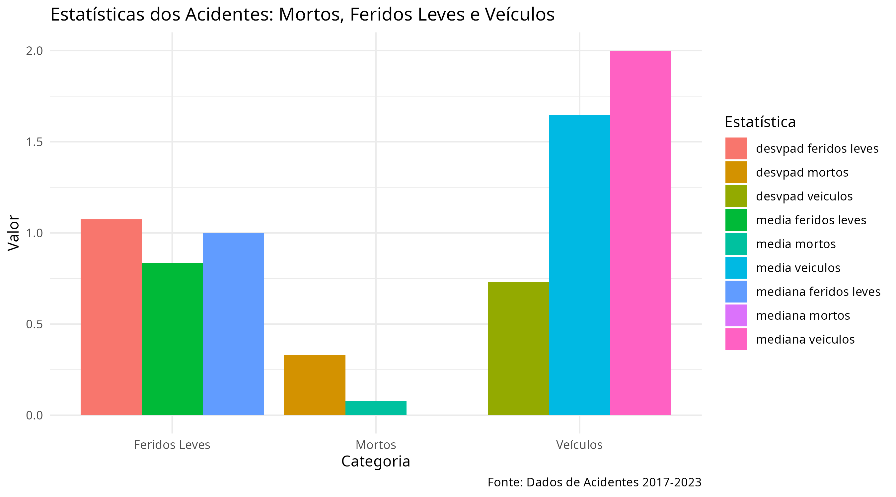
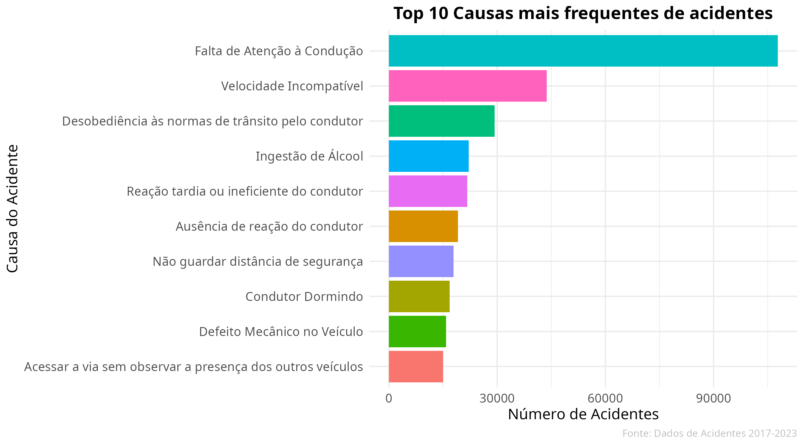
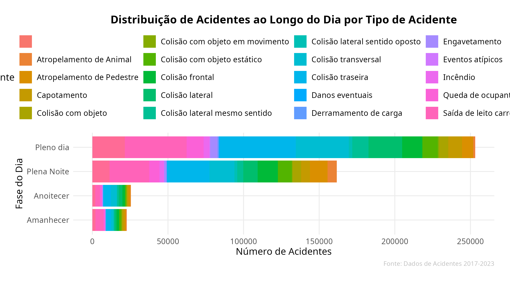
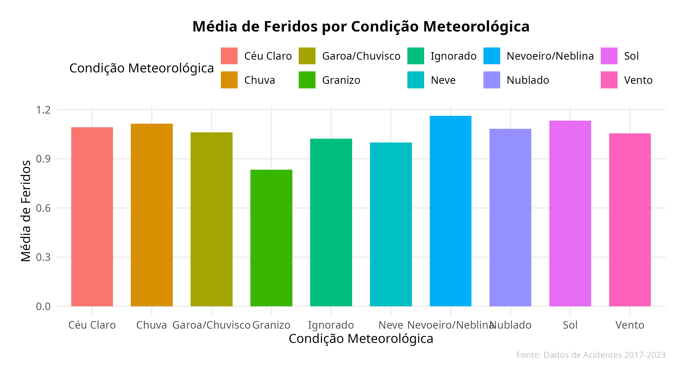
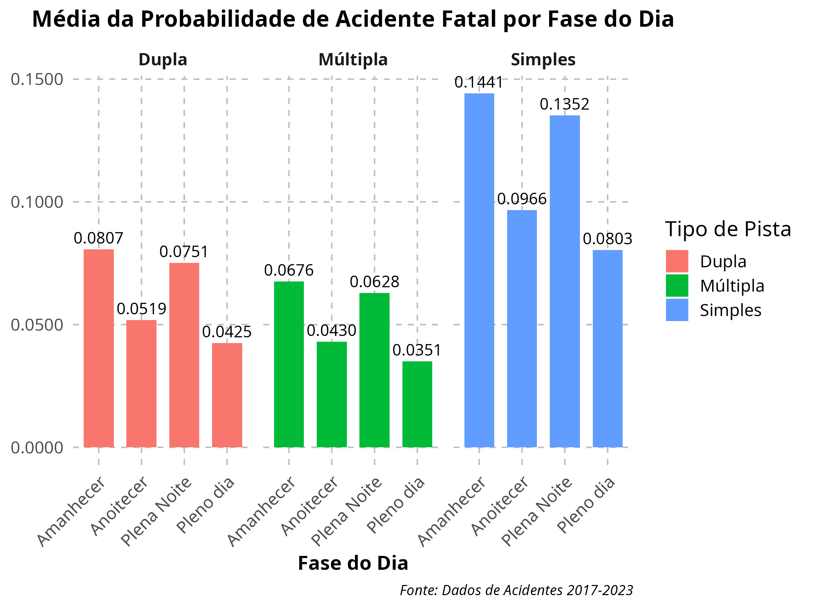
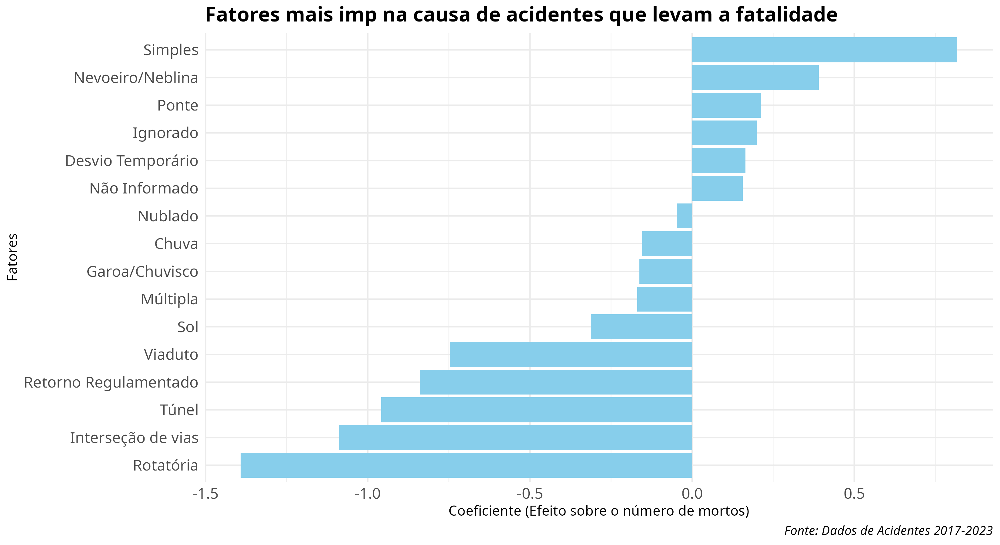

# Análise de Acidentes (2017-2023)

Este projeto analisa dados sobre acidentes ocorridos entre 2017 e 2023, fornecendo visualizações sobre causas de acidentes, lesões, condições meteorológicas e outros fatores importantes.

## Estatísticas dos Acidentes

Aqui está um gráfico das estatísticas dos acidentes (mortos, feridos leves e veículos):

## Top 10 Causas de Acidentes

Abaixo, você pode ver um gráfico com as 10 principais causas de acidentes:

## Distribuição de Acidentes ao Longo do Dia

Aqui está o gráfico de distribuição de acidentes ao longo do dia, por tipo de acidente:

## Média de Feridos por Condição Meteorológica

Gráfico que mostra a média de feridos por condição meteorológica:

## Causas de Acidente que Mais Impactam no Número de Feridos

Este gráfico mostra os coeficientes das causas de acidente que mais influenciam o número de feridos:

## Média da Probabilidade de Acidente Fatal por Fase do Dia

Este gráfico apresenta a média da probabilidade de acidentes fatais em diferentes fases do dia:

## Probabilidade de Acidente Fatal por Fase do Dia Especifico

Este gráfico apresenta a probabilidade de acidentes fatais especifica em diferentes fases do dia:

## Fatores Mais Relevantes nas Causas de Acidentes Fatais

Gráfico que apresenta os fatores mais relevantes nas causas de acidentes que levam à fatalidade:

